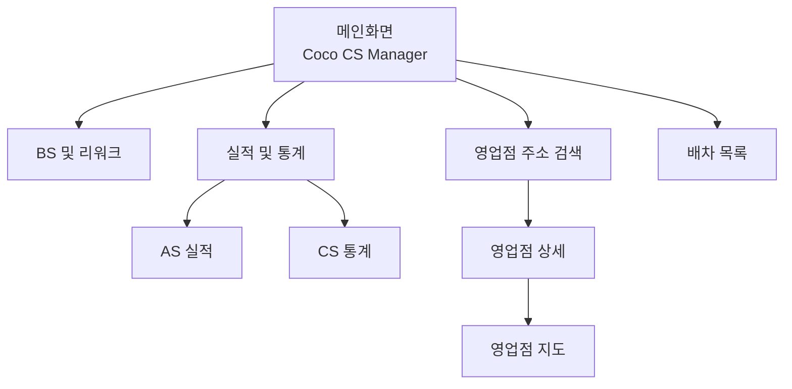

# 2026 Coco CS Manager - Apps Script 웹앱 Walkthrough

## 📋 프로젝트 개요

Figma 프로토타입을 기반으로 제작한 **Coco CS Manager** Apps Script 웹앱입니다.

---

## 📁 프로젝트 파일 구조

| 파일 | 설명 |
|------|------|
| [Code.gs](file:///c:/Users/전은진/Desktop/EUNJIN-Project/CocoCSManager/Code.gs) | 서버 사이드 코드 (doGet, 데이터 함수) |
| [Index.html](file:///c:/Users/전은진/Desktop/EUNJIN-Project/CocoCSManager/Index.html) | 메인 HTML 템플릿 (모든 화면 포함) |
| [Stylesheet.html](file:///c:/Users/전은진/Desktop/EUNJIN-Project/CocoCSManager/Stylesheet.html) | CSS 스타일시트 |
| [JavaScript.html](file:///c:/Users/전은진/Desktop/EUNJIN-Project/CocoCSManager/JavaScript.html) | 클라이언트 JavaScript |

---

## 🎨 디자인 사양

### 색상
- **Primary Blue**: `#1976D3` (헤더 및 강조)
- **Primary Dark**: `#1565C0`
- **Background**: `#F5F5F5`
- **Surface**: `#FFFFFF`

### 메뉴 스타일
- 흰색 배경 + 파란색 테두리
- 호버 시 파란색 배경 + 흰색 텍스트

### 반응형 설정
- 모바일 최적화 (max-width: 420px)
- viewport 메타태그로 스마트폰 해상도 자동 맞춤

---

## 🖼️ 구현된 화면

### 1. 메인화면
- **제목**: Coco CS Manager
- **메뉴**: BS 및 리워크, 실적 및 통계, 영업점 주소록, 배차 목록

### 2. [검색] BS 및 리워크
- 자산번호 검색 기능

### 3. 실적 및 통계
- AS 실적, CS 통계 서브메뉴

### 4. AS 실적
- **필터**: 수리구분 (전체/경수리/중수리), 날짜, 파트 (전체/서비스1~4), 마스터 선택
- 검색 버튼

### 5. 영업점 주소 검색
- 검색 → 상세 → 지도 3단계 흐름

### 6. 배차 목록
- **배차일 선택**: 날짜 선택창
- 검색 버튼

---

## 🔄 네비게이션 흐름

---

## 🚀 Apps Script 배포 방법

1. [script.google.com](https://script.google.com) → **새 프로젝트**
2. 4개 파일 추가:
   - `Code.gs`
   - `Index` (HTML)
   - `Stylesheet` (HTML)
   - `JavaScript` (HTML)
3. **배포** → **새 배포** → **웹 앱** 선택
4. 배포 후 URL로 접속

---

## ✅ 완료된 작업

- [x] Figma 프로토타입 분석
- [x] 전체 화면 구조 구현
- [x] 네비게이션 시스템 구현
- [x] 날짜 선택 달력 구현
- [x] 헤더 색상 통일 (#1976D3)
- [x] 메뉴 흰색 배경 적용
- [x] AS 실적 필터 수정 (수리구분, 파트, 마스터)
- [x] 배차 목록 날짜 선택 및 검색 추가
- [x] 샘플 데이터 제거
- [x] 스마트폰 반응형 설정

---

## ⏭️ 다음 단계

1. 스프레드시트 연동 (실제 데이터)
2. 카카오맵 API 연동 (지도 기능)
3. 마스터 목록 데이터 로드
